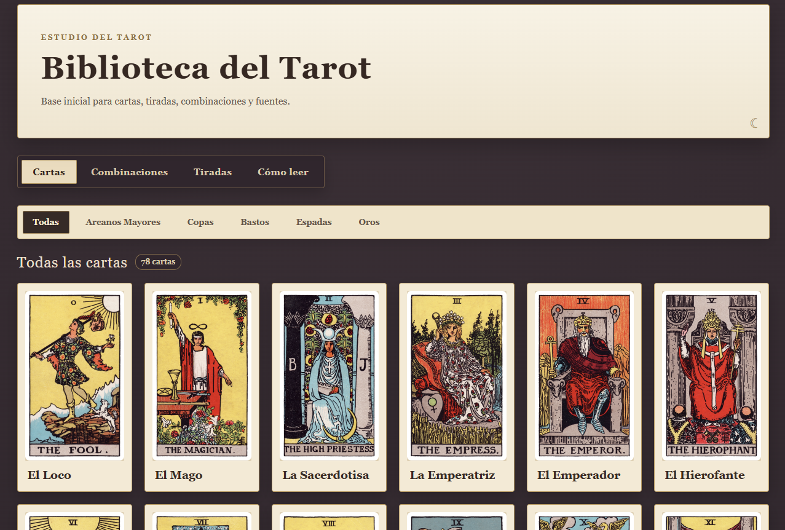
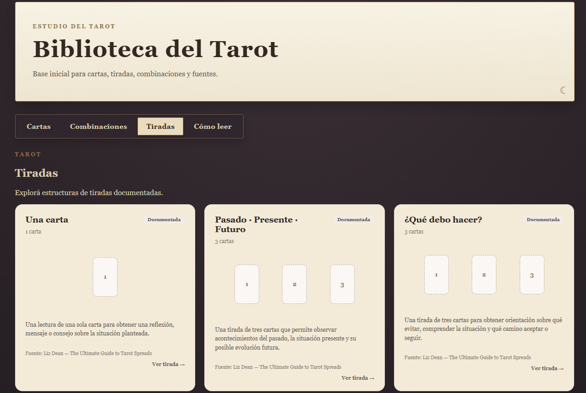
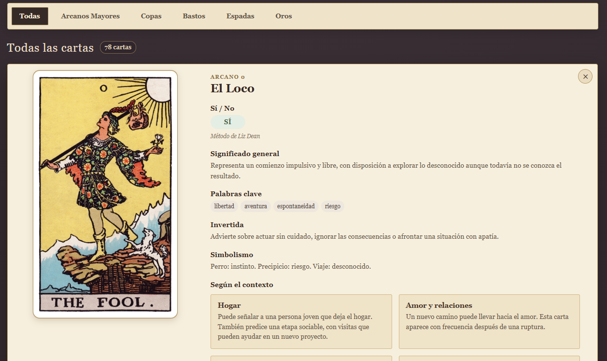

# Tarot RWS(Rider Waite Smith) — Estudio de Tarot interactivo

Aplicación web interactiva desarrollada con React, TypeScript y Vite
para explorar el Tarot Rider Waite Smith.

## Características

- 78 cartas del Tarot
- Significados al derecho e invertidos
- Palabras clave
- Simbolismo
- Interpretaciones según contexto
- Sistema Sí / No / Neutral
- Combinaciones de cartas
- Tiradas de Tarot documentadas
- Guías de interpretación
- Fuentes y referencias bibliográficas
- Diseño inspirado en el Tarot tradicional

## Tecnologías

- React
- TypeScript
- Vite
- CSS

## Fuentes

- Arthur Edward Waite — The Pictorial Key to the Tarot
- Liz Dean — The Ultimate Guide to Tarot Spreads
- Liz Dean — Tarot Card Meanings
- Dorothy Kelly — Combinaciones con el Tarot

## Prueba

```bash
npm install
npm run dev
```




